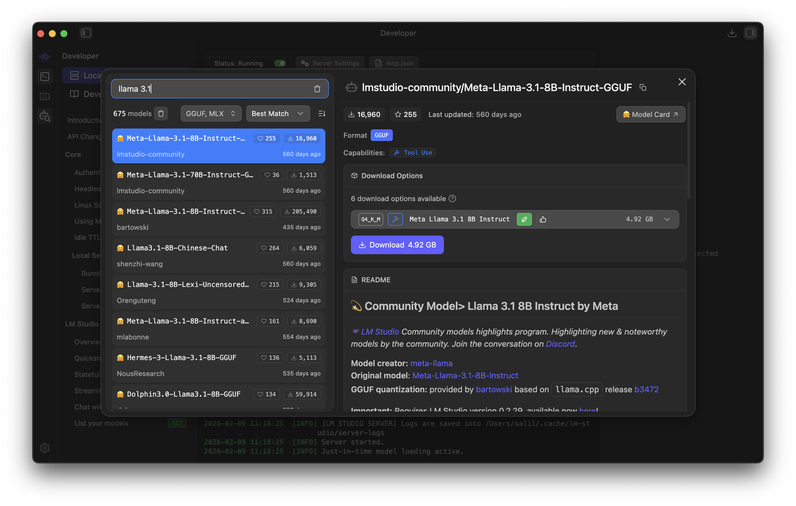
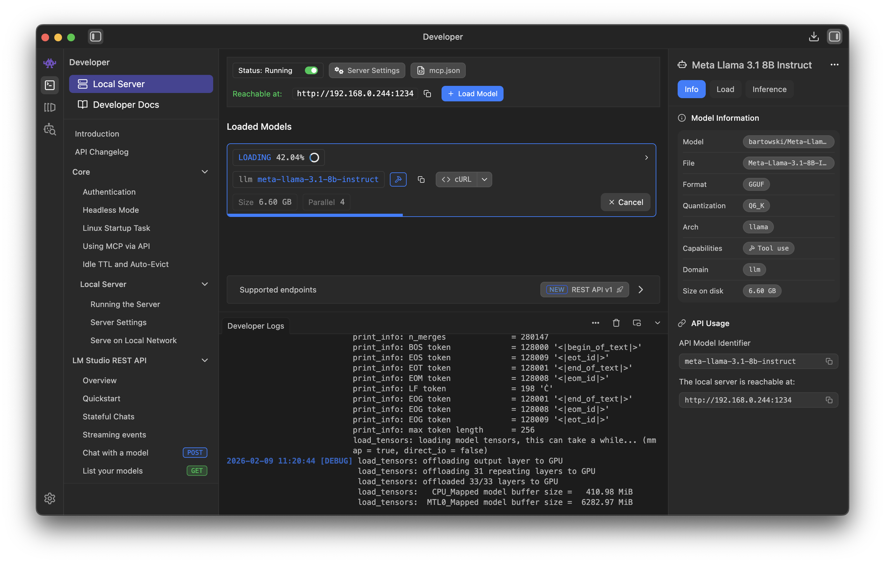
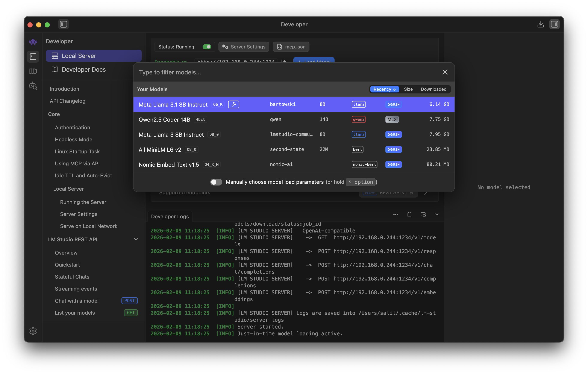
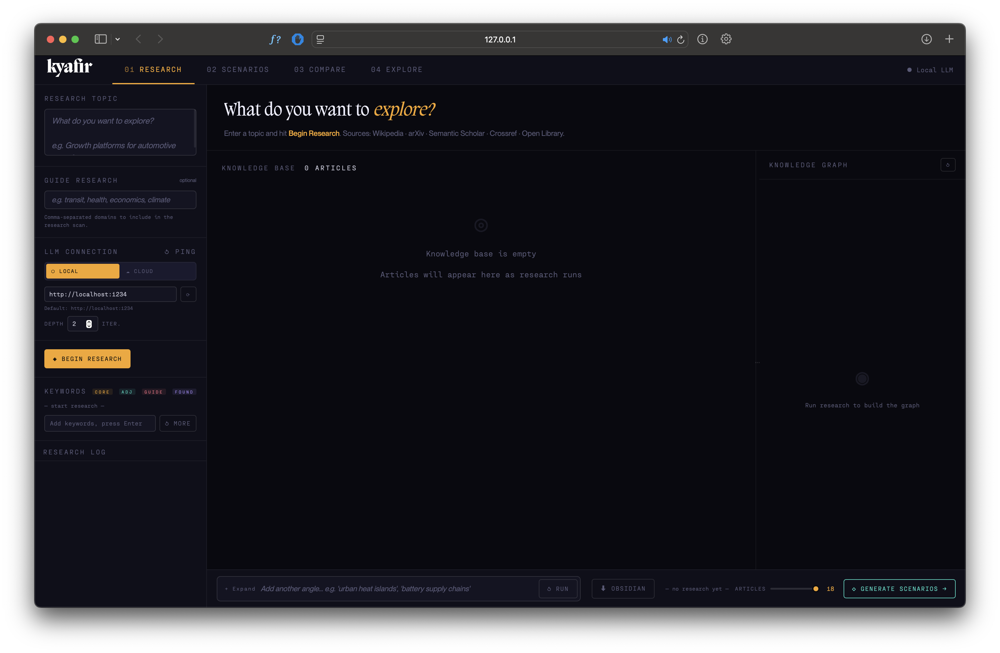

# kyafir

## Instructions

Step 1

Download LMStudio and download a model of your choice. Recommendation: Llama 3.1 8B (LMStudio will guide you on which flavour to download based on system specs)

Then, head to the server section (little terminal icon on the left bar), and click add "Load Model"

Select your model, and start the server.

Navigate to "Server Settings" and enable CORS if it isn't already enabled.

### Notes

- Switch between the Local (LMStudio on your machine) and Cloud (OpenAI API etc.) as desired.

- The slider at the bottom determines how many articles are taken into context when creating scenarios. I recommend using 15 at max when using a local machine with ~16GB RAM. If scenarios don't generate or you see an error in the logs, reduce that amount. Your results may vary.

- Comparing scenarios does tend to push the local LLMs quite a bit

- Accuracy and rigour is not the objective here. It's about storytelling, design fiction and speculation. Use the LLMs to help your ability to think outside the box, write stories, and investigate. 

- Feedback is always welcome!